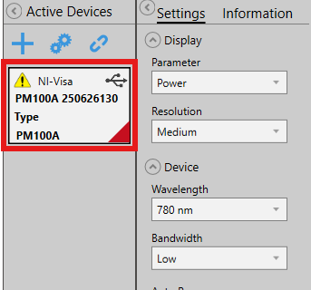
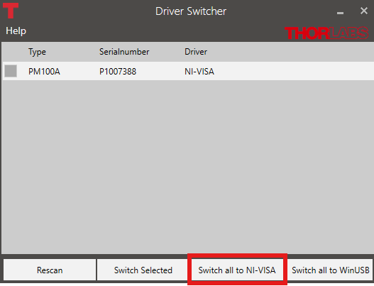

# About 

PANDAManager is a small Python-based laboratory data-acquisition and plotting project (notebooks + helpers) used to 
control instruments, acquire datasets (power meter, oscilloscope, temperature controller, etc.), and produce reproducible 
plots. 
The repository groups Jupyter notebooks for interactive acquisition and plotting, instrument configuration JSONs, 
raw/processed data, and small utility modules that implement common helpers.

# Repository layout

- `launch_pyrpl.ipynb`: Jupyter notebook to launch the Pyrpl GUI and configure the Pyrpl instrument;
- `requirements_base.txt `: Base requirements for the project, different from the PYRPL kernel;
- `requirements_pyrpl.txt`: Requirements for the PYRPL kernel;
 

- `utils/`:
  - `naming.py`: Helper functions to generate names for files and directories;
  - `oc3.py`: Helper functions to control the OC3 temperature controller;
  - `plot_style.py`: Helper functions to set plot style;
  - `pm100a.py`: Helper functions to control the PM100A power meter;
  - `temperature.py`: Helper functions to generate temperature lists;

- `acquisition/`:
  - `acquisition_knife`: Notebook for knife-edge data acquisition;
  - `acquisition_oscillo`: Notebook for oscilloscope data acquisition;
  - `acquisition_pm100a`: Notebook for PM100A power meter data acquisition;
  - `acquisition_shg`: Notebook for SHG data acquisition;
  - `acquisition_rigol`: Notebook for Rigol function generator data acquisition;

- `plot/`:
  - `figure/`: Save folder for figures;
  - `plot_oscillo`: Notebook for oscilloscope data plotting;
  - `plot_pm100a`: Notebook for PM100A power meter data plotting;
  - `plot_shg`: Notebook for SHG data plotting;

# PYVISA

Every electronic in the room is connected via PYVISA expect for the OC3 temperature controller which communicates via pyserial and the NKT laser which use the NKT DLL library.

## Thorlabs PM

The thorlabs powermeters sometimes failed to connect via pyvisa, even though they are properly listed in the ressource manager. By default, they use a USB protocole instead of the NI-visa. To change this:

1. Open the software called **Optical Parameter Monitor**
2. Double click on the rectangle with the device's name (if you do not see any device, add one using the plus sign)

3. The **driver switcher** pannel should open. You might need to restart it as admin.
4. Rescan, and click on **switch all to NI-VISA**.

5. Go back in the notebook, refresh the `rm = pv.ResourceManager()`, the powermeter should connect via pyvisa now.